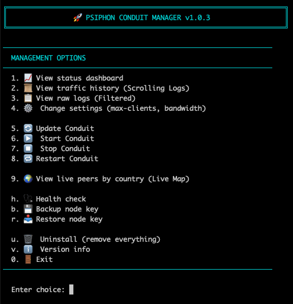
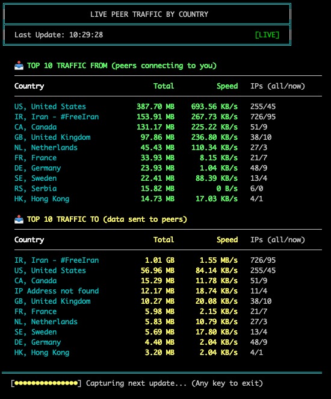

WORK IN PROGRES - NOT READY YET 


# Conduit Manager

A powerful management tool for deploying and managing Psiphon Conduit nodes on Linux servers. Help users access the open internet during network restrictions.

## Quick Install

```bash
curl -sL https://raw.githubusercontent.com/SamNet-dev/conduit-manager/main/conduit.sh | sudo bash
```

Or download and run manually:

```bash
wget https://raw.githubusercontent.com/SamNet-dev/conduit-manager/main/conduit.sh
sudo bash conduit.sh
```

## Features

- **One-Click Deployment** - Automatically installs Docker and configures everything
- **Multi-Distro Support** - Works on Ubuntu, Debian, CentOS, Fedora, Arch, Alpine, openSUSE
- **Auto-Start on Boot** - Supports systemd, OpenRC, and SysVinit
- **Live Monitoring** - Real-time connection stats with CPU/RAM monitoring
- **Live Peer Traffic** - Real-time traffic monitoring by country with GeoIP lookup
- **Easy Management** - Powerful CLI commands or interactive menu
- **Backup & Restore** - Backup and restore your node identity key
- **Health Checks** - Comprehensive diagnostics for troubleshooting
- **Complete Uninstall** - Clean removal of all components





## Supported Distributions

| Family | Distributions |
|--------|---------------|
| Debian | Ubuntu, Debian, Linux Mint, Pop!_OS, Kali, Raspbian |
| RHEL | CentOS, Fedora, Rocky Linux, AlmaLinux, Amazon Linux |
| Arch | Arch Linux, Manjaro, EndeavourOS |
| SUSE | openSUSE Leap, openSUSE Tumbleweed |
| Alpine | Alpine Linux |

## CLI Reference

After installation, use the `conduit` command:

### Status & Monitoring
```bash
conduit status       # Show current status and resource usage
conduit stats        # View live statistics (real-time)
conduit logs         # View raw Docker logs
conduit health       # Run health check diagnostics
conduit peers        # Live peer traffic by country (GeoIP)
```

### Container Management
```bash
conduit start        # Start the Conduit container
conduit stop         # Stop the Conduit container
conduit restart      # Restart the Conduit container
conduit update       # Update to the latest Conduit image
```

### Configuration
```bash
conduit settings     # Change max-clients and bandwidth
conduit menu         # Open interactive management menu
```

### Backup & Restore
```bash
conduit backup       # Backup your node identity key
conduit restore      # Restore node identity from backup
```

### Maintenance
```bash
conduit uninstall    # Remove all components
conduit version      # Show version information
conduit help         # Show help message
```

## Configuration Options

| Option | Default | Range | Description |
|--------|---------|-------|-------------|
| `max-clients` | 200 | 1-1000 | Maximum concurrent proxy clients |
| `bandwidth` | 5 | 1-40, -1 | Bandwidth limit per peer (Mbps). Use -1 for unlimited. |

**Recommended values based on server CPU:**

| CPU Cores | Max Clients |
|-----------|-------------|
| 8+ Cores | 800 |
| 4 Cores | 400 |
| 2 Cores | 200 |
| 1 Core | 100 |

## Installation Options

```bash
# Standard install
sudo bash conduit.sh

# Force reinstall
sudo bash conduit.sh --reinstall

# Uninstall everything
sudo bash conduit.sh --uninstall

# Show help
sudo bash conduit.sh --help
```

## Requirements

- Linux server (any supported distribution)
- Root/sudo access
- Internet connection
- Minimum 512MB RAM (1GB+ recommended)

## How It Works

1. **Detection** - Identifies your Linux distribution and init system
2. **Docker Setup** - Installs Docker if not present
3. **Container Deployment** - Pulls and runs the official Psiphon Conduit image
5. **Auto-Start Configuration** - Sets up systemd/OpenRC/SysVinit service
6. **CLI Installation** - Creates the `conduit` management command

## Security

- **Secure Backups**: Node identity keys are stored with restricted permissions (600)
- **No Telemetry**: The manager collects no data and sends nothing externally

---

<div dir="rtl">

# راهنمای فارسی - مدیریت کاندوییت

ابزار قدرتمند برای راه‌اندازی و مدیریت نود سایفون کاندوییت روی سرورهای لینوکس.

## نصب سریع

دستور زیر را در ترمینال سرور اجرا کنید:

```bash
curl -sL https://raw.githubusercontent.com/SamNet-dev/conduit-manager/main/conduit.sh | sudo bash
```

یا دانلود و اجرای دستی:

```bash
wget https://raw.githubusercontent.com/SamNet-dev/conduit-manager/main/conduit.sh
sudo bash conduit.sh
```

## ویژگی‌ها

- **نصب با یک کلیک** - داکر و تمام موارد مورد نیاز به صورت خودکار نصب می‌شود
- **پشتیبانی از توزیع‌های مختلف** - اوبونتو، دبیان، سنت‌اواس، فدورا، آرچ، آلپاین
- **راه‌اندازی خودکار** - پس از ریستارت سرور، سرویس به صورت خودکار اجرا می‌شود
- **مانیتورینگ زنده** - نمایش تعداد کاربران متصل و مصرف منابع
- **مانیتورینگ ترافیک** - نمایش لحظه‌ای ترافیک بر اساس کشور با GeoIP
- **مدیریت آسان** - دستورات قدرتمند CLI یا منوی تعاملی
- **پشتیبان‌گیری و بازیابی** - پشتیبان‌گیری و بازیابی کلید هویت نود
- **بررسی سلامت** - تشخیص جامع برای عیب‌یابی
- **حذف کامل** - پاکسازی تمام فایل‌ها و تنظیمات

## دستورات CLI

### وضعیت و مانیتورینگ
```bash
conduit status       # نمایش وضعیت و مصرف منابع
conduit stats        # آمار زنده (لحظه‌ای)
conduit logs         # لاگ‌های داکر
conduit health       # بررسی سلامت سیستم
conduit peers        # ترافیک بر اساس کشور (GeoIP)
```

### مدیریت کانتینر
```bash
conduit start        # شروع کانتینر
conduit stop         # توقف کانتینر
conduit restart      # ریستارت کانتینر
conduit update       # به‌روزرسانی به آخرین نسخه
```

### پیکربندی
```bash
conduit settings     # تغییر تنظیمات
conduit menu         # منوی تعاملی
```

### پشتیبان‌گیری و بازیابی
```bash
conduit backup       # پشتیبان‌گیری از کلید نود
conduit restore      # بازیابی کلید نود از پشتیبان
```

### نگهداری
```bash
conduit uninstall    # حذف کامل
conduit version      # نمایش نسخه
conduit help         # راهنما
```

## تنظیمات

| گزینه | پیش‌فرض | محدوده | توضیحات |
|-------|---------|--------|---------|
| `max-clients` | 200 | 1-1000 | حداکثر کاربران همزمان |
| `bandwidth` | 5 | 1-40, -1 | محدودیت پهنای باند (Mbps). برای نامحدود -1 وارد کنید. |

**مقادیر پیشنهادی بر اساس پردازنده (CPU):**

| تعداد هسته | حداکثر کاربران |
|------------|----------------|
| +8 هسته | 800 |
| 4 هسته | 400 |
| 2 هسته | 200 |
| 1 هسته | 100 |

## پیش‌نیازها

- سرور لینوکس
- دسترسی root یا sudo
- اتصال اینترنت
- حداقل 512 مگابایت رم

</div>

---

## License

MIT License

## Contributing

Pull requests welcome. For major changes, open an issue first.

## Links

- [Psiphon](https://psiphon.ca/)
- [Psiphon Conduit](https://github.com/Psiphon-Inc/conduit)
