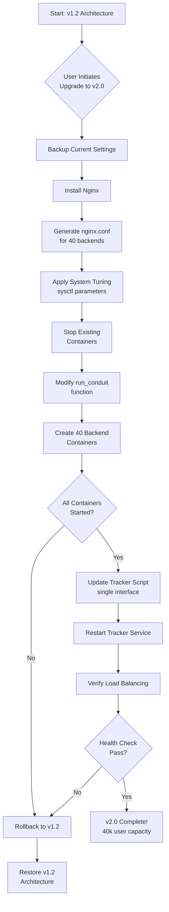

# Implementation Flow & Priority Matrix

## Implementation Flow Diagram



## Priority Matrix

### Phase 1: Critical Path (Days 1-3)
**Must-Have for v2.0 to Function**

| Priority | Task | Complexity | Risk | Estimated Time |
|----------|------|------------|------|----------------|
| P0 | Install Nginx package | Low | Low | 1h |
| P0 | Implement `generate_nginx_conf()` | Medium | Medium | 3h |
| P0 | Implement `tune_system()` | Low | Low | 2h |
| P0 | Modify `run_conduit()` network mode | High | High | 4h |
| P0 | Add port mapping logic (127.0.0.1:808X) | Medium | Medium | 2h |
| P0 | Add ulimit nofile=65535 | Low | Low | 1h |
| P0 | Test basic 40-container deployment | High | High | 4h |

**Total Phase 1**: ~17 hours

---

### Phase 2: Core Features (Days 4-5)
**Required for Full Functionality**

| Priority | Task | Complexity | Risk | Estimated Time |
|----------|------|------------|------|----------------|
| P1 | Update tracker script (single interface) | Medium | Medium | 3h |
| P1 | Test tracker with new architecture | Medium | Low | 2h |
| P1 | Verify GeoIP aggregation | Low | Low | 1h |
| P1 | Update dashboard display (TOTAL users) | Low | Low | 2h |
| P1 | Test dashboard with 40 containers | Medium | Low | 2h |
| P1 | Update `save_settings()` for v2.0 | Low | Low | 1h |

**Total Phase 2**: ~11 hours

---

### Phase 3: User Experience (Days 6-7)
**Migration & Safety Features**

| Priority | Task | Complexity | Risk | Estimated Time |
|----------|------|------------|------|----------------|
| P2 | Implement `migrate_to_v2()` | Medium | Medium | 4h |
| P2 | Implement `rollback_to_v1()` | Medium | Low | 3h |
| P2 | Create backup/restore logic | Low | Low | 2h |
| P2 | Add migration prompts/warnings | Low | Low | 2h |
| P2 | Test migration path | High | High | 4h |

**Total Phase 3**: ~15 hours

---

### Phase 4: Polish & Documentation (Days 8-10)
**Documentation & Edge Cases**

| Priority | Task | Complexity | Risk | Estimated Time |
|----------|------|------------|------|----------------|
| P3 | Update README.md | Low | Low | 2h |
| P3 | Add CLI help for new commands | Low | Low | 1h |
| P3 | Create troubleshooting guide | Medium | Low | 3h |
| P3 | Write performance testing guide | Medium | Low | 2h |
| P3 | Document capacity planning | Low | Low | 2h |
| P3 | Add error handling edge cases | Medium | Medium | 4h |

**Total Phase 4**: ~14 hours

---

### Phase 5: Testing & Validation (Days 11-14)
**Quality Assurance**

| Priority | Task | Complexity | Risk | Estimated Time |
|----------|------|------------|------|----------------|
| P2 | Unit test: Nginx config generation | Low | Low | 2h |
| P2 | Unit test: System tuning verification | Low | Low | 2h |
| P2 | Unit test: Container port mapping | Medium | Low | 2h |
| P1 | Integration test: Full deployment | High | High | 6h |
| P1 | Load test: 10k concurrent users | High | Medium | 4h |
| P1 | Load test: 40k concurrent users | High | High | 6h |
| P2 | Stress test: Resource exhaustion | Medium | Medium | 4h |
| P2 | Migration test: v1.2 → v2.0 → v1.2 | Medium | Medium | 4h |

**Total Phase 5**: ~30 hours

---

## Risk Assessment Matrix

### High Risk Items
| Risk | Impact | Mitigation Strategy |
|------|--------|---------------------|
| Nginx misconfiguration causes downtime | High | Test config with `nginx -t` before reload; keep backup |
| Container networking breaks existing deployments | High | Implement rollback function; preserve data volumes |
| System tuning breaks other services | Medium | Apply tuning gradually; document each change |
| Load balancing doesn't distribute evenly | Medium | Monitor with `docker stats`; adjust Nginx algorithm |
| 40 containers exhaust system resources | High | Provide capacity planning guide; add resource checks |

### Medium Risk Items
| Risk | Impact | Mitigation Strategy |
|------|--------|---------------------|
| Tracker fails to detect main interface | Medium | Fallback to eth0; add manual override option |
| Dashboard aggregation shows incorrect totals | Low | Thorough testing; compare with docker stats |
| Migration leaves orphaned containers | Low | Clean up logic in migration script |
| Users don't read migration warnings | Medium | Interactive prompts; require explicit confirmation |

---

## Implementation Dependencies

```
tune_system()
     ↓
generate_nginx_conf()
     ↓
install_nginx
     ↓
run_conduit() [MODIFIED]
     ├─→ Container 1-40 with bridge network
     ├─→ Port mapping 127.0.0.1:8081-8120
     └─→ ulimit nofile=65535
     ↓
regenerate_tracker_script() [MODIFIED]
     └─→ tcpdump -i <main_interface> port 443 or 5566
     ↓
show_dashboard() [UPDATED]
     └─→ Display TOTAL aggregated users
     ↓
migrate_to_v2()
     └─→ Orchestrate all above changes
```

---

## Rollback Strategy

### Safe Rollback Points

1. **Before Migration**: Full backup of settings.conf
2. **After Nginx Install**: Can stop Nginx, containers still work
3. **After System Tuning**: sysctl changes are safe to keep or revert
4. **After Container Recreation**: Data volumes preserved, can recreate with old config
5. **After Tracker Update**: Old tracker script backed up

### Rollback Triggers

- **Automatic Rollback** if:
  - Nginx config test fails (`nginx -t` returns error)
  - No containers start successfully
  - Health check fails for >5 minutes

- **Manual Rollback** if:
  - User chooses to revert
  - Performance issues detected
  - System resources exhausted

---

## Validation Checklist

### Pre-Deployment
- [ ] System meets minimum requirements (16GB RAM, 8 CPU cores)
- [ ] Backup of current installation created
- [ ] Nginx package available in repositories
- [ ] No port conflicts on 443, 5566
- [ ] Docker service running properly

### Post-Deployment
- [ ] All 40 containers running (`docker ps | wc -l`)
- [ ] Nginx listening on 443, 5566 (`netstat -tulpn`)
- [ ] System tuning applied (`sysctl -a | grep somaxconn`)
- [ ] Tracker service active (`systemctl status conduit-tracker`)
- [ ] Dashboard shows aggregated totals
- [ ] Test connection from external client
- [ ] Load distribution verified (`docker stats`)

### Performance Validation
- [ ] Accept 1,000 concurrent connections
- [ ] Accept 10,000 concurrent connections
- [ ] Accept 40,000 concurrent connections
- [ ] CPU usage < 80% under load
- [ ] Memory usage < 90% under load
- [ ] No file descriptor exhaustion
- [ ] Even load distribution across backends

---

## Success Metrics

### Functional Metrics
- ✓ All 40 containers running and healthy
- ✓ Nginx distributing traffic evenly
- ✓ Dashboard showing accurate aggregated totals
- ✓ Tracker capturing traffic on main interface
- ✓ All existing features still working (QR, Telegram, backups)

### Performance Metrics
- ✓ Support 40,000 concurrent users
- ✓ Connection latency < 100ms (p50)
- ✓ Connection latency < 500ms (p99)
- ✓ Zero packet loss under normal load
- ✓ Graceful degradation under overload

### Operational Metrics
- ✓ Clean migration from v1.2
- ✓ Rollback capability verified
- ✓ Clear documentation available
- ✓ Troubleshooting guide covers common issues
- ✓ Monitoring and alerts functional

---

## Timeline Summary

| Phase | Duration | Deliverable |
|-------|----------|-------------|
| Phase 1: Critical Path | 3 days | Basic 40-container deployment working |
| Phase 2: Core Features | 2 days | Full feature parity with v1.2 |
| Phase 3: User Experience | 2 days | Migration tools and safety features |
| Phase 4: Documentation | 3 days | Complete docs and guides |
| Phase 5: Testing | 4 days | Validated and production-ready |
| **Total** | **14 days** | **v2.0 Release** |

---

## Quick Start Implementation Order

For fastest path to working v2.0:

1. **Day 1**: Implement `tune_system()` and `generate_nginx_conf()`
2. **Day 2**: Modify `run_conduit()` with new networking
3. **Day 3**: Test 40-container deployment, fix critical bugs
4. **Day 4**: Update tracker script, test monitoring
5. **Day 5**: Update dashboard, verify aggregation
6. **Day 6**: Implement migration script
7. **Day 7**: Full integration test
8. **Days 8-10**: Documentation and polish
9. **Days 11-14**: Load testing and validation

---

## Next Steps

### For Implementation Team
1. Review this implementation flow
2. Set up development/staging environment
3. Begin Phase 1: Critical Path
4. Run validation checklist after each phase
5. Document any deviations or issues

### For Review
- [ ] Architecture approved
- [ ] Timeline acceptable
- [ ] Resource requirements clear
- [ ] Risk mitigation adequate
- [ ] Ready to proceed with implementation

---

**Document**: Implementation Flow & Priority Matrix  
**Version**: 1.0  
**Companion**: conduit-v2-architecture.md  
**Status**: Ready for Implementation
